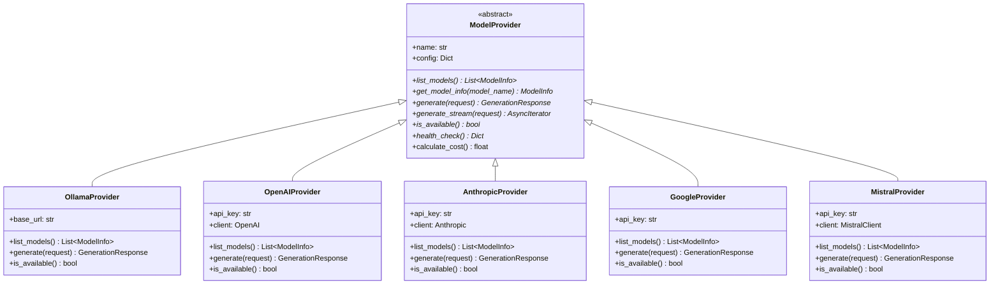

# Visual Architecture & Flowcharts

This document contains comprehensive visual diagrams for the AI Model Manager MCP Server project.

## Table of Contents
1. [System Architecture Overview](#system-architecture-overview)
2. [Component Architecture](#component-architecture)
3. [Data Flow Diagrams](#data-flow-diagrams)
4. [Sequence Diagrams](#sequence-diagrams)
5. [Database Schema](#database-schema)
6. [Provider Integration Flow](#provider-integration-flow)

---

## System Architecture Overview

---

## Component Architecture

---

## Data Flow Diagrams

### Generation Request Flow

### Model Comparison Flow

### Health Check Flow

---

## Sequence Diagrams

### Server Initialization

### List Models Operation

### Save Conversation Operation

---

## Database Schema

---

## Provider Integration Flow

### Provider Class Hierarchy

### Data Models

---

## MCP Tools & Resources Flow

---

## Cost Tracking Flow

---

## Configuration Management

---

## Error Handling Flow

---

## Future Enhancements Architecture

---

## Summary

This visual architecture documentation provides:

1. **System Architecture**: High-level overview of all components and their interactions
2. **Component Architecture**: Detailed view of the codebase structure
3. **Data Flow Diagrams**: How data moves through the system
4. **Sequence Diagrams**: Step-by-step operation flows
5. **Database Schema**: Data persistence structure
6. **Provider Integration**: How different AI providers are integrated
7. **Cost Tracking**: How costs are calculated and logged
8. **Configuration Management**: How settings are managed
9. **Error Handling**: How errors are caught and handled
10. **Future Enhancements**: Planned architectural improvements

All diagrams use Mermaid syntax and can be rendered in GitHub, VS Code, or any Mermaid-compatible viewer.